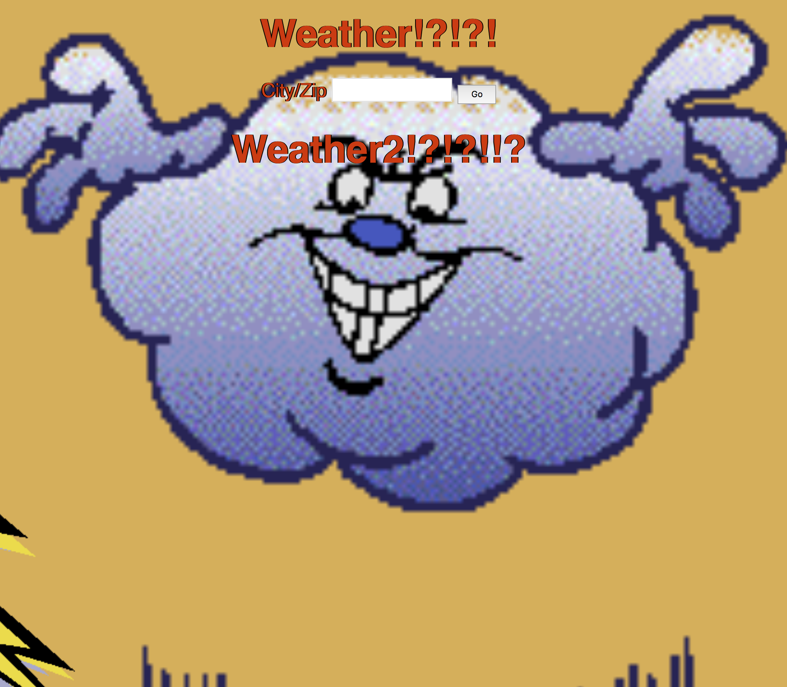

# Weather

  

My Weather App uses an API brought in by the "fetch" command to give the user the ability to search for different city's by name or zip code. It will then "fetch" the relevant data and display that data on the page.
